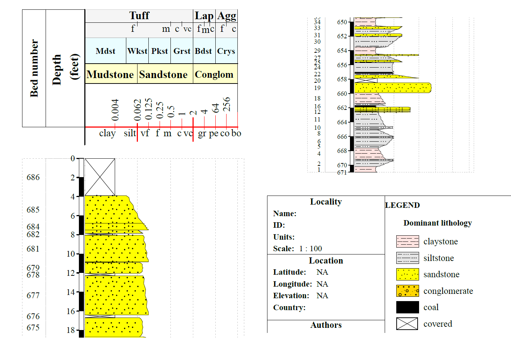

```{r ,include=FALSE }

knitr::opts_chunk$set(fig.width = 6, message = FALSE, warning = FALSE, comment = "", cache = F)
library(flipbookr)
library(countdown)
countdown::countdown()
```


#<b>Gabriel Bertolini</b>

- Áreas de atuação
  - Proveniencia Sedimentar 💨💨💨
  - Sistemas éolicos de grande porte 🐪🏜🏝🐫
  - Diagênese e interação lava-sedimento 🔥
  - Geocronologia U-Pb em zircão 💠💎
- Pesquisador em projeto de cooperação UFRGS-University of Aberdeen
  - Bolsista insititucional de Pós-Doutorado PPGGEO-UFRGS - CAPES PrInt
- Doutor em geociências pela University of Aberdeen e Universidade Federal do Rio Grande do Sul
  - Bolsista CNPq SWE
  - Bolsista FAURGS em projeto temático
- Geólogo pela Universidade do Vale do Sinos- Unisinos
  - Bolsista CNPq Iniciação Científica
  - Bolsista CNPq SWB mobilidade internacional com Universitat de Alicante


-gabertol@gmail.com

---
#<b>R</b>

-Linguagem livre sob GNU GPL v2..
-.. ou seja, desenvolvida em código aberto e através de esforço coletivo internacional

  - Linguagem alto nivel
  - Multiparadigma - orientada a objeto, funcional ...
  - Construida a partir de linguagens de mais baixo nível - C e Fortran 


-Download da linguagem básica e pacotes (CRAN!)
  - https://www.r-project.org/

IDE (<i>integrated development environment</i>)
  - https://www.rstudio.com/

---
#RStudio

```{r,echo=FALSE,fig.align='center',out.width="150%"}
 knitr::include_graphics("figs/Rstudio.png")
```

---

#<b>Sintaxe básica 1</b>


```{r}
2+1  # Operação matemática básica

A<- 2+1 # Atribuindo operação matemática a objeto "A"

A # Rodando objeto A

A<-2
B<-1

A+B

C<- A+B

C

```


---
#<b>Sintaxe básica 2</b>


```{r}

A<-2
B<-1

Soma_A_B<-function(Objeto_1,Objeto_2){
  Objeto_1+Objeto_2
}

Soma_A_B(Objeto_1=A,
         Objeto_2=B)

```


---
# Programação funcional
- Programação funcional segue lógica diferente, baseada numa série de funções
- Para este exemplo, vamos utilizar 2 pacotes:
```{r}
library(tidyverse)
library(ggpubr)

```
---

`r chunk_reveal("teste")`

```{r teste, warning=FALSE, message=FALSE}

read.csv("petrophysics_bertolini_2020.csv", sep=";") %>% 
  as_tibble() %>%
  drop_na(p_wave,s_wave) %>% 
  ggplot(aes(x=p_wave,
             y=s_wave)) + 
  geom_point(aes(col=density,
                 size=porosity))+
  geom_smooth(method="lm")+
  stat_cor(aes(label=paste(..r.label..,..p.label.., sep="~','~")), 
           method="spearman")+
  labs(title="",
      x="P-Wave velocity (km/s)",
      y="S-Wave velocity (km/s)")+
  theme_bw()
```

---

#<b>Geologia e programação</b>
 
- R pode substituir rotinas de trabalho comumente aplicadas no dia-a-dia do geólogo

- Tidyverse
  - dplyr ( %>% e manipulação de dados)
  - ggplot (plots!)
  - tidyR (dados Tidy!)
  - readR (importação..)

---

#<b>Geologia e programação</b>

- Pacotes de dados espaciais e API's de dados

  - sf
  - sp
  - raster
  - geobr
  - chronosphere 
  - RStoolbox
  - Leaflet / mapview

---
#<b>Geologia e programação</b>

- Pacotes de estatistica em geologia

  - IsoplotR (Pacote para geocronologia)
  - Provenance (Pacote para proveniência)
  - ggtern (Pacote para plotar diagramas ternários)
  - Tidypaleo e SDAR (Pacote para dados estratigráficos)
  - Astrochron (Pacote para ancoragem de ciclos de rochas a ciclos orbitais)
  - EMMAGEO ou endmember (Pacotes para modelamento end-member)

---

#<b>Geologia e programação</b>

- Vantagens

  - Liberdade
  - Reprodutibilidade
  - Gratuito
  - Desincentiva o uso de aplicações "caixa preta estatística"

- Desvantagens

  - Curva de aprendizado
  - "travar"

 
---

#<b>Geologia e programação</b>

- Excel?
- ArcGIS ou QGIS?
- Surfer?
- CorelDRAW ou Illustrator?


---
#<b>Estudos de caso do dia</b>

- Manipulação de banco de dados
- Plots basicos
- Dados Espaciais
- Dados estratigráficos

---

#<b>Explorando dados geológicos I</b>
## Quais os ambientes geotectônicos e quantas amostras estão disponíveis para cada ambiente? 
- O tidyverse provem um serie de pacotes para manipulação e plot de dados
```{r}
library(tidyverse) # Importar packages
```

- Para este estudo de caso vamos utilizar dados geoquimicos de granitos (Bonin et al., 2020)

```{r,echo=FALSE,fig.align='center',out.width="75%"}
 
```

---
  - Primeiro definimos nosso diretorio de trabalho
```{r}
setwd("D:/Documentos Drive/Academicos/Aulas/Palestras/Geologia_R/geology_r") 
```

- Depois podemos importar os dados para o R
```{r}
gm_granite<-read.csv(file="geoquim_granite.csv",
                     sep=";") 
# Importar dados a partir de planilha,  notar uso do atributo sep 
#que indica qual o tipo de caractere que separa cada célula 
```

---

- Podemos agora checar a estrutura do banco de dados

```{r}
str(gm_granite)
```

- Quantas amostras para ambiente tectonico temos
```{r, warning=FALSE, message=FALSE}

gm_granite %>% 
  count(Tectonic_setting) 

#função count do dplyr retorna n() para cada grupo
# de tectonic settings do banco de dados

```

---
#<b>Explorando dados geológicos I</b>
## Manipulação de dados e plots


- Qual a relação entre elementos quimicos e ambiente geotectônicos? 

  - Para isso vamos utilizar uma serie de funções para manipular bancos de dados
  - Tambem iremos utilizar o pacote ggplot para plotarmos os dados

---

`r chunk_reveal("gran_2")`

```{r gran_2, include = FALSE}
gm_granite %>% 
  select(Tectonic_setting,SiO2:P2O5) %>%
  drop_na() %>% 
  group_by(Tectonic_setting) %>% 
  mutate(across(cols=TiO2:P2O5,
                .fns = as.double)) %>% 
  pivot_longer(cols = TiO2:P2O5,
               names_to="Major_element",
               values_to="values") %>% 
  ggplot(aes(x=Major_element,
             y=values,
             color=Major_element,
             fill=Major_element)) + 
  geom_boxplot()+
  facet_wrap(~Tectonic_setting)+
  theme(axis.text.x = element_text(angle = 90, vjust = 0.5, hjust=1))
```
---

#<b>Explorando dados geológicos I</b>
## Manipulação de dados e plots

- Qual a relação entre feldspatos e ambiente geotectônicos? 
  - Talvez fosse interessante utilizar diagrama ternários
  - Para isso vamos utilizar o pacote GGTERN, que adiciona o estilo ternário ao tidyverse

---

`r chunk_reveal("gran_3")`

```{r gran_3, warning=FALSE, include=FALSE}
library(ggtern)

gm_granite %>% 
  select(Group,Or,Ab,An,TASMiddlemostPlut) %>%
  drop_na() %>% 
  filter(Group=="2- Archaean TTG") %>% 
  ggtern(aes(Or,Ab,An)) + 
  stat_density_tern(geom='polygon',
                    aes(fill=..level..),
                    bins=5,
                    color="gray")+
  geom_point(size=1.2,
             alpha=.7,
             aes(col=TASMiddlemostPlut,
                 shape=TASMiddlemostPlut))+
  theme_bw()+
  labs(title="Ab-An-Or em granitoides Arqueanos TTG")
```
---

#<b>Explorando dados geológicos II</b>
## Dados Espaciais 

- O R suporta a utilização de dados espaciais complexos através de pacotes especificos
  - O pacote SF provem a computação necessária para lidar com shapefiles, rasters..

- Também é conveniente utilizar algum tipo de API para baixar os dados de bancos de dados
  - O pacote GEOBR do Inpe provem vários bancos de dados oficias do Brasil

- Por fim, podemos utilizar algum pacote para visualizarmos esses dados de formas que nos interessam
  - O pacote mapview provem uma maneira pratica para criarmos dados interativos

---

```{r , warning=FALSE}

library(sf) #pacote para lidar com dados espaciais
library(geobr) # API de dados espaciais BR


poa <- read_municipality(code_muni= 4314902) %>% 
  st_transform(crs=3857) %>% 
  dplyr::select(geom)

#codigo IBGE dos municipios BR 
#https://www.ibge.gov.br/explica/codigos-dos-municipios.php

```

---
```{r , warning=FALSE}
library(mapview) # Pacote para mapas interativos

mapview(poa,alpha=0.5,
        color="red",
        lwd=3)


```
---
#<b>Explorando dados geológicos II</b>
## Dados Espaciais 
- O pacote SF pode ser usado para atividades básicas de SIG como transformação de coordenadas e clips
  - Autalmente não temos API de dados de geologia, porem podemos baixa-los no geobank da CPRM
  - Para este estudo de caso, fiz o download do mapa geológico do RS

```{r}
geo_shape<-st_read("./shape/riograndedosul_lito.shp")

```


---

`r chunk_reveal("SIG_1")`

```{r SIG_1, warning=FALSE, include=FALSE, font_size = 10}

geo_shape %>% 
  dplyr::select(SIGLA_UNID,NOME_UNIDA) %>% 
  tidyr::drop_na(geometry) %>%  
  st_transform(crs=3857) %>% 
  st_intersection(.,poa) %>% 
  mapview(.,zcol="SIGLA_UNID",alpha=0.5,lwd=3)
```

---
# E se quisermos um mapa de Caçapava do Sul?

```{r,warning=FALSE}
cpava <- read_municipality(code_muni= 4302808) %>%
  st_transform(crs=3857) %>% 
  dplyr::select(geom)
```

---

.pull-left[
```{r AAAA, eval=FALSE}
geo_shape %>% 
  dplyr::select(SIGLA_UNID,NOME_UNIDA) %>% 
  tidyr::drop_na(geometry) %>%  
  st_transform(crs=3857) %>% 
  st_intersection(.,cpava) %>% 
  mapview(.,zcol="SIGLA_UNID",alpha=0.1,lwd=3)
```
]

.pull-right[
```{r AAAA-out, ref.label="AAAA", echo=FALSE}
```
]


---

#<b>Explorando dados geológicos II</b>
## Dados Espaciais a partir de dados de URL 

- Para esse exemplo, vamos utilizar dados geocronologicos da Fm. Serra Geral
- Para isso vamos baixar os dados diretamento do link do artigo (Gomes & Vasconcelos, 2021)

```{r}
library(readxl)
library(tidyverse)
library(parzer)
library(mapview)
library(sf)

download.file("https://ars.els-cdn.com/content/image/1-s2.0-S0012825221002178-mmc1.xlsx", destfile = "./file.xlsx",mode = "wb")
ages<-read_xlsx("D:/Documentos Drive/Academicos/Aulas/Palestras/Geologia_R/geology_r/file.xlsx",sheet=1)
glimpse(ages)
```

---
- A seguir vamos "limpar" o dado para que possamos plotar os dados
- Bancos de dados importados seguem estetiticas diferentes, para ajustar esse em particular selecionamos a classificação de Peate para mostrar os pontos

.pull-left[
```{r BBBBB, eval=FALSE}
ages %>% 
  rename(Hemi_long="E/W",
         Hemi_lat="N/S",
         Peate="Paraná classification                                                                   (Peate et al., 1992)") %>%
  filter(!Latitude=="not reported") %>% 
      # !Peate %in% c("not analysed","not reported","-")) %>% 
  unite(long_DMS,Longitude,Hemi_long, sep="") %>% 
  unite(lat_DMS,Latitude,Hemi_lat, sep="") %>%
  dplyr::mutate(Peate=str_remove(Peate,"[?]"),
        long_DMS=str_replace(long_DMS,",","."),
         lat_DMS=str_replace(lat_DMS,",","."),
         Lon = parzer::parse_lon(long_DMS),
         Lat = parzer::parse_lat(lat_DMS)) %>% 
  sf::st_as_sf(coords=c("Lon","Lat"),crs=4326) %>% 
  mapview(zcol="Peate")
```
]

.pull-right[
```{r BBBBB-out, ref.label="BBBBB", echo=FALSE}
```
]


---
- Vamos dar uma olhada nas idades das lavas - essa compilação apresenta datações do tipo Ar-Ar
.pull-left[
```{r CCCCC, eval=FALSE}
ages %>% 
  rename(Hemi_long="E/W",
         Hemi_lat="N/S",
         Peate="Paraná classification                                                                   (Peate et al., 1992)",
         age="Recalculated age (Ma)") %>%
  filter(!Latitude=="not reported") %>%
  unite(long_DMS,Longitude,Hemi_long, sep="") %>% 
  unite(lat_DMS,Latitude,Hemi_lat, sep="") %>%
  mutate(age=as.double(age),
        Peate=str_remove(Peate,"[?]"),
        long_DMS=str_replace(long_DMS,",","."),
         lat_DMS=str_replace(lat_DMS,",","."),
         Lon = parzer::parse_lon(long_DMS),
         Lat = parzer::parse_lat(lat_DMS)) %>% 
   drop_na(age) %>%
  st_as_sf(coords=c("Lon","Lat"),crs=4326) %>% 
  mapview(zcol="age")
```
]

.pull-right[
```{r CCCCC-out, ref.label="CCCCC", echo=FALSE}
```
]

---
- Legal né, mas fica complicado enxergar as diferenças de idades com um oceano entre as amostras, certo?

- Pra resolver isso, vamos utilizar o pacote chronosphere, que é uma mistura de API de dados paleogeográficos e funções de transformação espacial para o passado
  - Mas primeiro, vamos criar um banco de dados atualizado (notar que atribui as funções anteriores a um objeto - BD_ages)
```{r, warning=FALSE,message=FALSE}
BD_ages<-ages %>% 
  rename(Hemi_long="E/W",
         Hemi_lat="N/S",
         Peate="Paraná classification                                                                   (Peate et al., 1992)",
         age="Recalculated age (Ma)") %>%
  filter(!Latitude=="not reported") %>%
  unite(long_DMS,Longitude,Hemi_long, sep="") %>% 
  unite(lat_DMS,Latitude,Hemi_lat, sep="") %>%
  mutate(age=as.double(age),
        Peate=str_remove(Peate,"[?]"),
        long_DMS=str_replace(long_DMS,",","."),
         lat_DMS=str_replace(lat_DMS,",","."),
         Lon = parzer::parse_lon(long_DMS),
         Lat = parzer::parse_lat(lat_DMS))
```

---
- Agora podemos transformar as coordenadas atuais para o passado
```{r , warning=FALSE}
library(chronosphere)

coord_K<-BD_ages %>% 
  dplyr::select(Lon,Lat) %>% 
  chronosphere::reconstruct(age=140) %>% 
  as_tibble() %>% 
  dplyr::select(lon_k=Lon,
                lat_k=Lat)

BD_ages_2<-cbind(BD_ages,coord_K) %>% 
  drop_na(lat_k) %>% 
  drop_na(age) %>%
  filter(between(age,132,137)) %>% 
  st_as_sf(coords=c("lon_k","lat_k"),crs=4326)
```
---
- Aqui, vamos usar a o API do pacote para baixar paleomapa do Cretáceo Inferior do Scotese (2016)
- Na sequencia salvamos os dados com a função write Raster
```{r, eval=F}

library(raster)

#map1 <- fetch(dat="paleomap", res=0.1,var="paleoatlas",ver="20160216v3")
map2<-map1["140",]
R<-map2[1]
G<-map2[2]
B<-map2[3]

map3<-raster::brick(R,G,B,crs=4326)
raster::writeRaster(map3,'Early_K_paleomap.tif',
                    overwrite=TRUE,
                    datatype="INT1U",
                    options="TFW=YES", 
                    format="GTiff")

```

--- 
- Por fim, vamos montar o mapa com o pacote TMAP
```{r}
library(tmap)
library(raster)
map4<-raster("Early_K_paleomap.tif")
```
---

```{r}
Final_Map<-tm_shape(map4,bbox=tmaptools::bb(xlim=c(-60, 60), ylim=c(-60, 30)))+ #bbox=st_bbox(BD_ages)
tm_rgb()+ 
tm_shape(BD_ages_2)+
tm_dots(col="age",size=.2,style="cont")+
tm_compass(type="4star")+
tm_grid(alpha = 0.5)+
tm_layout(main.title="Distribuição de Idades Ar-Ar no Cretáceo Inferior",
  legend.outside="T")+
tm_scale_bar(position=c("left", "bottom"))

```
---
```{r, fig.height=8, fig.width=15}
Final_Map
```

---

#<b>Explorando dados geológicos III</b>
## Dados estratigráficos

- Vamos explorar 2 pacotes para plotarmos dados estratigráficos
  - Pacote tidypaleo para plots simples de dados geolóogicos
  
```{r}
library(tidypaleo)
```
---

Para isso, vamos utilizar o banco de dados de Bertolini, 2021
```{r,echo=FALSE, fig.align='center', out.width="75%"}
 
```


---
`r chunk_reveal("teste_1")`

```{r teste_1, eval=FALSE}
read.csv("petrophysics_bertolini_2020.csv", sep=";") %>% 
  as_tibble() %>%
  pivot_longer(cols=c(p_wave,s_wave,porosity), values_to="value",names_to="var") %>% 
  ggplot(aes(x = value, y = depth)) +
  geom_lineh() +
  geom_point() +
  scale_y_reverse() +
  facet_geochem_gridh(vars(var), grouping = vars(well),scales="free") +
  labs(y = "Depth (m)")
```

---
#<b>Explorando dados geológicos III</b>
## Dados estratigráficos

- Pacote SDR para perfis sedimentares
```{r}
library(SDAR)
library(DT)
```
 -  Usaremos como exemplo, banco de dados beds de salterin (Jaramillo, 2017)
 
```{r,echo=FALSE,fig.align='center',out.width="75%"}
 
```

---
 
```{r}

fpath <- system.file("extdata", "SDAR_v0.95_beds_saltarin.xlsx", package = "SDAR")
beds_data <- read_excel(fpath)
validated_beds <- strata(beds_data)     # validates the Saltarin_beds dataset

validated_beds %>% 
  as_tibble() %>% 
  dplyr::select(1:5) %>% 
  DT::datatable(caption = "Formato de dado estratigráfico para pacote SDAR")

```
---
```{r}
plot(validated_beds)
```

```{r,echo=TRUE,fig.align='center',out.width="50%"}
 
```

---
# <b>"Take home message"</b>

- A linguagem de programação R proporciona uma liberdade enorme para o geocientista
- Produtividade !!
- Outras linguagens de alto nivel como python, podem ser usadas também com o mesmo intuito
- Pacotes resolvem os mais variados problemas 
- Mercado de ciência de dados muito aquecido


---
# <b>Obrigado!!</b>


- gabertol@gmail.com
- https://github.com/gabertol/geology_r